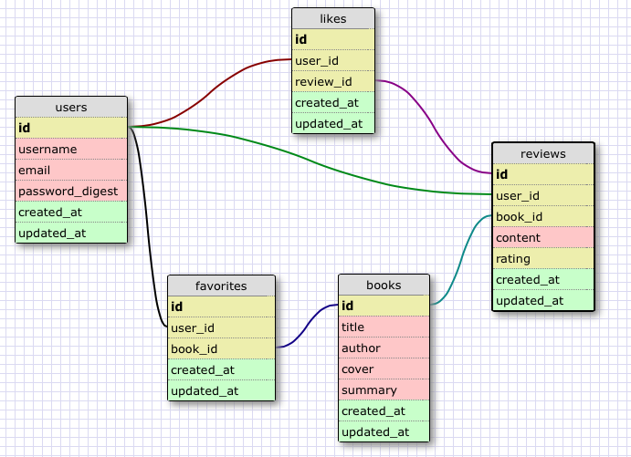

# bookrater

Discover new books and find out what people are saying about them.

## Database Schema



## Installation

### Backend API

Run bundle to install all dependencies

```
bundle install
```

Create, migrate, and seed the database:

```
bin/rake db:create db:migrate db:seed
```

Run the Rails server:

```
bin/rails s
```

The server will be available at <http://localhost:3000>

### Frontend

To run the **frontend server**, use the following command from the `App/` directory

```
ruby -run -e httpd . -p 9000
```

Alternatively, you can also use **serve** to run the frontend server, if you are in the root directory of the repository:

```
serve -p 9000 App/
```

(use `npm install -g serve` to install serve)

The frontend server will be available at <http://localhost:9000>
